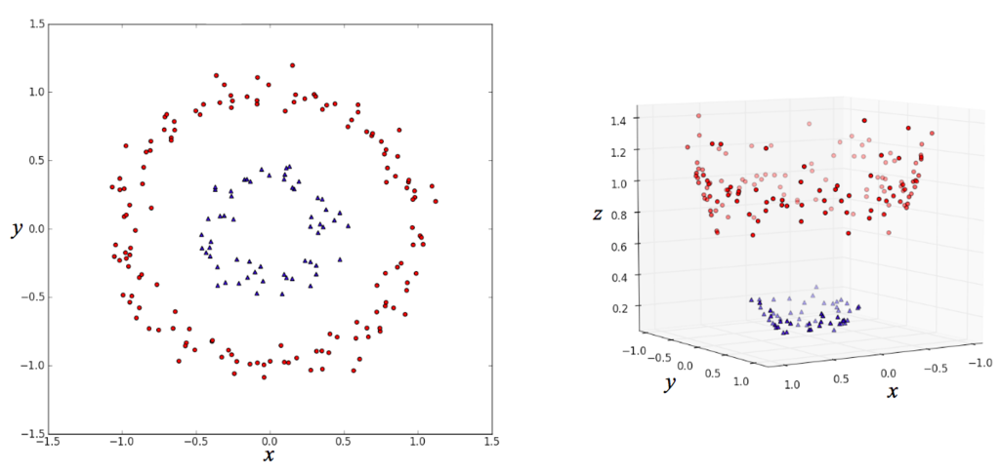
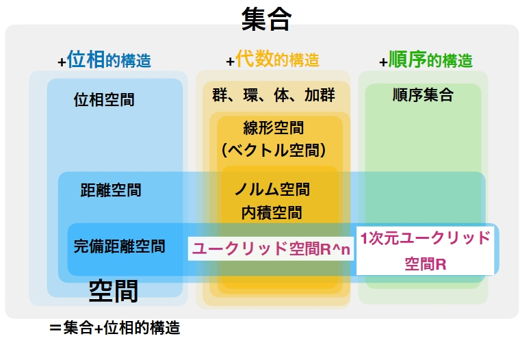
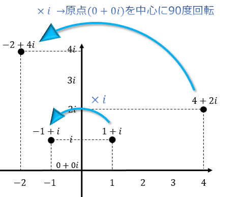
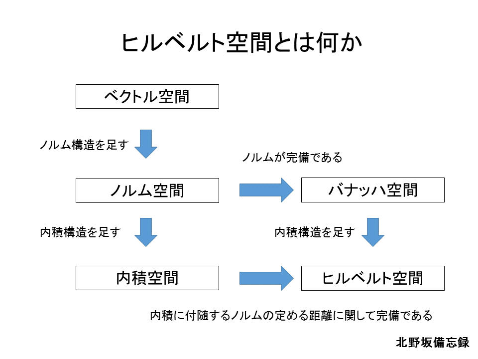
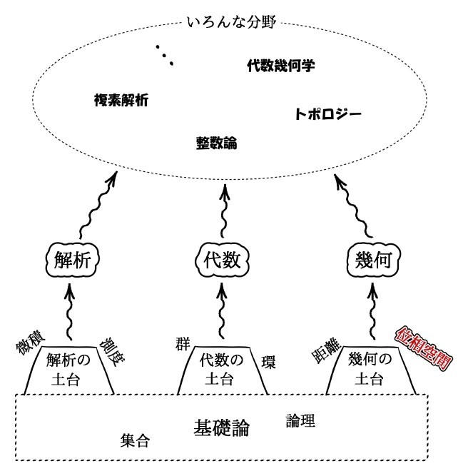
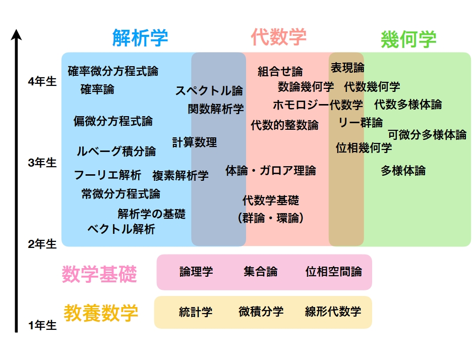

### 1.SVM(サポートベクターマシン）とカーネル

もっとも有名であろう機械学習ライブラリ scikit-learn を用いる。  
scikit-learn に搭載されている SVM 分類器　 sklearn.svm.SVC=> Support Vector Classification.
これらには多種多様なカーネルと呼ばれるものが搭載されている。
？？？？？OS のカーネルではないのか？一体カーネルとはなんなのか？その謎の追及にも迫る。

カーネル(OS）->

オペレーティングシステムの基本コンポーネントとして、カーネルはメモリ、CPU、入出力を中心としたハードウェアを抽象化し、ハードウェアとソフトウェアがやり取りできるようにする。また、ユーザープログラムのための機能として、プロセスの抽象化、プロセス間通信、システムコールなどを提供する。

カーネル（機械学習）->

カーネルトリック!!!!???

理解を進めるにつれて後記のカーネルは特徴量エンジニアリング(主成分分析など）に近しいものであるということがわかった。
分類や回帰、クラスタリングなど色々ある機械学習手法を用いてデータから何かしらのヒントを得ようと思った時に必要なのは、そのデータがどのようなデータであるかを知っておくことであろう。学習にかける前に人間側からあらかじめわかりやすいように加工を施してあげることにより学習の制度を向上させる。これは特徴量エンジニアリングにおいて前処理と呼ばれ、標準化、正規化、主成分分析、そしてグラフによる可視化もこの工程に入るかもしれない。
デジタルコンペ Kaggle 的な言い方で言うと EDA(データの理解)の後に行う作業である。

http://enakai00.hatenablog.com/entry/2017/10/13/145337
↓
『データが本来的にもっているであろう性質やら、過去の試行錯誤の経験を元に、手探りで特徴量エンジニアリングを進めていくことになります。』
結局、前処理や EDA などの特徴量エンジニアリングは人間自らが行わなければならないもの、ここをめんどくせえええと思った先人がいたのか？

たとえば、上のような左図の場合（x,y）平面で表現されているに限っては分類はめんどくさそうに見えます。
しかし、右のように新たな z 軸を設けてあげることにより分類を容易にしています。そう、(x,y)の平面から(x,y,z)の局面へと変換していると言うことになります。
この場合であれば z=x2+y2 を追加することによりそれを実現しています。

これを念頭に入れて少し戻ります。
そもそもなぜ、特徴量エンジニアリングは必要であるのか？と言うことです。
その理由は機械学習が**多数の特徴量を用意して、それらをモデルに入力**すると言うプロセスをとるからでしょう。
例えば、
X={x1,x2,⋯,xK}
X と言う変数があったとします。一直線上に点が分散しているイメージ

これに対して
ϕ={ϕ1(x),ϕ2(x),⋯,ϕM(x)}
ϕ1(x)=x21 とか ϕ2(x)=x1x2 があるとします。

X が K 個あったとして ϕ は X 内の組み合わせの数だけ存在するはずなので K<M が成り立つでしょう。つまるところ、膨大な数の組み合わせ計算を用意しているのです。
さっきの(x,y,z)の図でやっていたことと同じことをしようと本質的にはしているのですが、あちらの場合と異なり現実の問題では M 個の中から Z に相当するものを見付け出さなければならないと言うことです。しかし、これらの中からどうやって Z を見つけ出せばいいのか？これが大変重要な問題でしょう。M 個全てを Z(遅くなったがこの場合は y)に代入してもっともスコアの高いものを抽出するのか？途方にくれるやもしれません。

ここで遂にカーネルトリックと言う言葉が登場します。

例えば、この上図の場合、(x,y)の二次元空間を z を含む新たな３次元空間に写像することにより、超平面による分離を可能にしています。
この導出に至る流れをカーネルトリックと呼びます。
K(x1,x2)=φx1・φx2
φx1 は x1 と言う点を新たに写像した結果として出てきた点をさします。
そして K(x1,x2)はこれら二つの内積を表します。内積はある意味ではベクトルの類似度を表しているといえます。どれだけ同じ方向を向いているのかと言う指標にもなりえます。この場合であれば、原点（０、０、0）からの３次元ベクトルになっており、点同士の内積は原点から見て点同士がどれくらい近しいいちに存在しているかの指標になります。

この K(x1,x2)=φx1・φx2 をカーネル関数と呼びます。
ここで、あれ？となるのは K は引数として φx1 と φx2 を直接もらっていないと言うことです。K が引数として受け取っているのは写像後のベクトルではなく、写像前のベクトルになっています。これが味噌であり、もっとも面倒な適切な写像関数を導出せずとも分離に導ける方であると言えます。これをカーネルトリックと呼びます。
このカーネルトリックの種類として、
Polynomial kernel(多項式カーネル）
Gaussian 　 kernel(ガウシアンカーネル)
後述する
Linear kernel（線形カーネル）
Radial Basis function kernel(動径基底関数カーネル)
Precomputed kernel
Sigmoid kernel
などなど色々あります。
結論としてカーネルの意義は線形分離が不可能なデータ群を高次元空間に写像し非線形分離を可能にするための方法であった。

X={x1,x2,⋯,xK}　 ϕX={ϕ1(x),ϕ2(x),⋯,ϕM(x)} K 次元データ X を M 次元データ φX に写像する関数 φ とはなんなのかと言うことを突き詰めて汎用性を向上させる必要性があるだろう。

これらデータを実際に単純パーセプトロンを用いて実装した手法として SVM が存在する。
単純パーセプトロンの次元数 W を最適化する各サポートベクターのマージン最大化があげられる。

下図式より
識別結果 f(x)は重みパラメータ W の転置式と入力ベクトル x

多変量解析と言う言葉にであった。
多変量解析とは何か？
多変量解析には主成分分析、重回帰分析、クラスター分析などありそこにカーネル法も含まれている。https://www.sist.ac.jp/~suganuma/kougi/other_lecture/SE/multi/multi.html より、多変量解析は主成分分析などに代表されるように多くの変数（変量）をもつデータに対して目的に応じた統合を促すための方法である。簡単に言えば生データを機械学習などで取り扱いやすくするための手法である。これらの多変量解析手法は生データの特性とその使用目的に応じて使い分けられる。

機械学習の手法云々カンヌンの前に SVM はカーネル法を引数として撮ることによって依存している理由はなんでなのだろうか？

SVM は二つのクラスに属しているいくつかの点を分類する幾多の超平面の中で、最大限に二つのクラスのいくつかの点と距離を維持するものを探すアルゴリズムといえる。(by wikipedia) サポートベクターの概念を表している一文。

線形分離不可能な問題への適用の章(wikipedia)において
SVM の初期型は線形分離のみの対応であったが再生核ヒルベルト空間の理論を取り入れたカーネル関数の登場により非線形分離を可能とした。

カーネル関数を取り入れた一連の手法では、どのような写像が行われるか知らずに計算できることから、カーネルトリック (Kernel Trick) と呼ばれている。

主に下記のカーネル関数がよく使われていて LIBSVM でも実装されている。

線形
多項式
放射基底関数
シグモイド関数

と書かれている。

また新たな謎である線形空間の概念が現れた。

① ベクトル空間
至高の御身たるヨビノリのたくみによると、ベクトルと言う概念そもそもが我々の実生活空間に置ける矢印の概念の一般化であると説明している。これをまとめたものを数学門的にはベクトル公理と呼ぶ。この公理に従うものをベクトルと呼ぶ。そしてこのベクトルの集合体(数学的には集合と呼ぶ)をベクトル空間と呼ぶ。

例えば　リアルの空間は実数空間と言えるんじゃないか？とか考えてみる。実数の集合体とも考えることもできると思う。

さらに言えば実世界で負はあり得ないかもしれない。0 も無しにして自然数のみで構成されているとした時あらゆるものが 3 次元の実数ベクトルで表現んできるようになる

これを３次元ユークリッド空間と呼ぶ。
３次元の自然数ベクトルの集合をそう呼ぶだけなのである。

ほう。となる。
ユークリッド空間は簡単に言えば、ベクトル空間（線形空間）の中のノルム空間の中の部分集合なのである。

わお！！！！意味わかんね。

これを言葉を置き換えれば、
１：ベクトル計算ができます。
２：ノルムの計算ができます。
これら二つの特性を合わせ持った自然数の集まりです。と言ってるようなものである。

例えば、ベクトルとベクトルの足し算ができますし、あるベクトルを拡大縮小するスカラー倍という操作もできます。このような性質（他にもいくつか必要ですが）を持った空間を、線形空間（ベクトル空間）と言います。
また、単に線形空間であるだけでなく、内積によって 2 つのベクトルの角度を測ったり、ノルムによって 2 つのベクトルの距離を測ることができます。

なんとなくわかってきた。

つまりは
この世には実数が無限に存在するだろう。(実数空間)
ある点を言語化する時、基準点からの距離を用いれば良いと考える。（ノルム空間）
距離を表すために実数を羅列し、保有させる。これをベクトルと呼び扱うことにしよう。
しかし、保有するにしても演算の方法を決めねばならない。
例えばたてベクトルの前からとケツからを足しても言い訳であるから、そこを公理と言う法則で縛ったものをベクトル空間と呼ぶ。
そして、ノルム空間の中で自然数を扱うものをユークリッド空間と呼ぶ。

また新たな謎

ε-δ 論法とは
微分のなんで 0 になんねん問題を解決すべく現れた救世主
Δx を 0 に勝手に置き換えると言う謎行為、これにより瞬間変化率たる導関数を導ける
ε-δ 論法の肝は「関数のある瞬間の変化を直線(線形)で近似した時、元の関数との誤差を無限に小さくできる値が確定するならそれを微係数としよう」

そうか！！0 は使いたくないなら 0 を明示的に表す変数を作りゃいいんだ！！！　これを ε と呼ぶ。以上である。

再生核ヒルベルト空間とは？

ベクトル空間の中のノルム空間の中のヒルベルト空間の中のユニタリ空間の中のユークリッド空間の中の三次元ユークリッド空間が我々が日々近くしている空間と言える。わお！！

三次元ユークリッド空間とは
->xyz の３つの基底ベクトルからなる実世界空間である。（基底ベクトルは互いに独立で直行している）

ユークリッド空間
->ここで言うユークリッド空間はさっきは三つしかなかった基底ベクトルを有限の範囲全てをさす。よって N 次元ユークリッド空間をさす。

ユニタリ空間
->ユークリッド空間にある概念をプラスする。複素数という概念である。これにより実数の縛りから解き放たれる。これを N 次元ユニタリ空間と呼ぶ

        複素数とは？
        ->みんな大好きiが登場する。iとはi*iをすると-1にできると仮定した謎の存在である
        
        しかし、これを見てもらえばわかるように、複素数iを用いることで複素数平面をを表せ、iをかけるだけで90度回転できる。
        https://www.nicovideo.jp/watch/sm6514026

        複素数が役立つもの
        ・フーリエ解析(フーリエ級数展開)
        ・マクローリン展開
        ・テイラー展開

ヒルベルト空間
->ユニタリ空間に無限の概念をプラスする。

http://www.scc.u-tokai.ac.jp/~nfujii/note/Tenk03s2.pdf
https://www.ism.ac.jp/~fukumizu/ISM_lecture_2010/Kernel_2_basics.pdf

空間定義を逆向きに考えると、
まず位相空間と線型空間が定義される。
① 位相空間->

大学数学に置ける柱（青学の柱になれ）は３つ　『解析』『代数』『幾何』である。

この図の示すことは『解析』『代数』『幾何』を考える上で欠かせない概念（土台）の存在である。
『解析』において微積が欠かせないのと同様に、幾何においては位相空間という概念がとても重要になるらしい。

そもそも『解析』『代数』『幾何』はなんなのか？

https://math-fun.net/20180711/412/
https://math-fun.net/20180723/882/
https://math-fun.net/20190604/1304/

代数学は、整数や方程式をより一般化したものや、対称性を調べる分野。

幾何学は、図形や空間の性質を調べる分野。

解析学は、微分・積分をツールとして関数の性質を調べる分野。

つまるところ位相空間は n 次元空間を考えるときに使う概念である。
実世界において物体というものを考えるとき必然となるルールは連続していることである。
例えばコップは連続したオブジェクト物体である。
ゆえに水がこぼれず器としての機能を果たしている。

この考え方から、連続するものこの世の森羅万象全てを一括りにしたものを 位相と呼ぶ。

位相を考えるためには集合論を意識する必要性がある。
そしてそれに基づいた写像という概念も理解しなければならない。(全射、単射、全単射の概念)

② 線形空間->

再生核ヒルベルト空間(再生カーネルヒルベルト空間)
->「ヒルベルト空間」には内積構造があるわけですが、この内積を「再生性」があるように定めた特殊なヒルベルト空間を「再生核ヒルベルト空間」と言います。

ノルム空間
->その名の通りノルムという概念のプラスである。
ノルムすなわち距離である。ここにきて L1 ノルム（マンハッタン距離）や L2 ノルム（ユークリッド距離）が登場することで個々のベクトル同士の関係性が見えてくる。

ベクトル空間
->ここまでの大元の概念であるベクトルという概念をプラスする。
実世界の矢印を数学的に一般化したものを公理としてもつ
