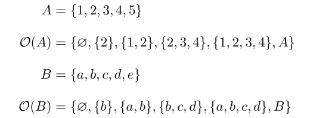

### 1.SVM(サポートベクターマシン）とカーネル

もっとも有名であろう機械学習ライブラリ scikit-learn を用いる。  
scikit-learn に搭載されている SVM 分類器　 sklearn.svm.SVC=> Support Vector Classification.
これらには多種多様なカーネルと呼ばれるものが搭載されている。
？？？？？OS のカーネルではないのか？一体カーネルとはなんなのか？その謎の追及にも迫る。

カーネル(OS）->

オペレーティングシステムの基本コンポーネントとして、カーネルはメモリ、CPU、入出力を中心としたハードウェアを抽象化し、ハードウェアとソフトウェアがやり取りできるようにする。また、ユーザープログラムのための機能として、プロセスの抽象化、プロセス間通信、システムコールなどを提供する。

カーネル（機械学習）->

カーネルトリック!!!!???

理解を進めるにつれて後記のカーネルは特徴量エンジニアリング(主成分分析など）に近しいものであるということがわかった。
分類や回帰、クラスタリングなど色々ある機械学習手法を用いてデータから何かしらのヒントを得ようと思った時に必要なのは、そのデータがどのようなデータであるかを知っておくことであろう。学習にかける前に人間側からあらかじめわかりやすいように加工を施してあげることにより学習の制度を向上させる。これは特徴量エンジニアリングにおいて前処理と呼ばれ、標準化、正規化、主成分分析、そしてグラフによる可視化もこの工程に入るかもしれない。
デジタルコンペ Kaggle 的な言い方で言うと EDA(データの理解)の後に行う作業である。

http://enakai00.hatenablog.com/entry/2017/10/13/145337
↓
『データが本来的にもっているであろう性質やら、過去の試行錯誤の経験を元に、手探りで特徴量エンジニアリングを進めていくことになります。』
結局、前処理や EDA などの特徴量エンジニアリングは人間自らが行わなければならないもの、ここをめんどくせえええと思った先人がいたのか？

たとえば、上のような左図の場合（x,y）平面で表現されているに限っては分類はめんどくさそうに見えます。
しかし、右のように新たな z 軸を設けてあげることにより分類を容易にしています。そう、(x,y)の平面から(x,y,z)の局面へと変換していると言うことになります。
この場合であれば z=x2+y2 を追加することによりそれを実現しています。

これを念頭に入れて少し戻ります。
そもそもなぜ、特徴量エンジニアリングは必要であるのか？と言うことです。
その理由は機械学習が**多数の特徴量を用意して、それらをモデルに入力**すると言うプロセスをとるからでしょう。
例えば、
X={x1,x2,⋯,xK}
X と言う変数があったとします。一直線上に点が分散しているイメージ

これに対して
ϕ={ϕ1(x),ϕ2(x),⋯,ϕM(x)}
ϕ1(x)=x21 とか ϕ2(x)=x1x2 があるとします。

X が K 個あったとして ϕ は X 内の組み合わせの数だけ存在するはずなので K<M が成り立つでしょう。つまるところ、膨大な数の組み合わせ計算を用意しているのです。
さっきの(x,y,z)の図でやっていたことと同じことをしようと本質的にはしているのですが、あちらの場合と異なり現実の問題では M 個の中から Z に相当するものを見付け出さなければならないと言うことです。しかし、これらの中からどうやって Z を見つけ出せばいいのか？これが大変重要な問題でしょう。M 個全てを Z(遅くなったがこの場合は y)に代入してもっともスコアの高いものを抽出するのか？途方にくれるやもしれません。

ここで遂にカーネルトリックと言う言葉が登場します。


例えば、この上図の場合、(x,y)の二次元空間を z を含む新たな３次元空間に写像することにより、超平面による分離を可能にしています。
この導出に至る流れをカーネルトリックと呼びます。
K(x1,x2)=φx1・φx2
φx1 は x1 と言う点を新たに写像した結果として出てきた点をさします。
そして K(x1,x2)はこれら二つの内積を表します。内積はある意味ではベクトルの類似度を表しているといえます。どれだけ同じ方向を向いているのかと言う指標にもなりえます。この場合であれば、原点（０、０、0）からの３次元ベクトルになっており、点同士の内積は原点から見て点同士がどれくらい近しいいちに存在しているかの指標になります。

この K(x1,x2)=φx1・φx2 をカーネル関数と呼びます。
ここで、あれ？となるのは K は引数として φx1 と φx2 を直接もらっていないと言うことです。K が引数として受け取っているのは写像後のベクトルではなく、写像前のベクトルになっています。これが味噌であり、もっとも面倒な適切な写像関数を導出せずとも分離に導ける方であると言えます。これをカーネルトリックと呼びます。
このカーネルトリックの種類として、
Polynomial kernel(多項式カーネル）
Gaussian 　 kernel(ガウシアンカーネル)
後述する
Linear kernel（線形カーネル）
Radial Basis function kernel(動径基底関数カーネル)
Precomputed kernel
Sigmoid kernel
などなど色々あります。
結論としてカーネルの意義は線形分離が不可能なデータ群を高次元空間に写像し非線形分離を可能にするための方法であった。


X={x1,x2,⋯,xK}　 ϕX={ϕ1(x),ϕ2(x),⋯,ϕM(x)} K 次元データ X を M 次元データ φX に写像する関数 φ とはなんなのかと言うことを突き詰めて汎用性を向上させる必要性があるだろう。

これらデータを実際に単純パーセプトロンを用いて実装した手法として SVM が存在する。
単純パーセプトロンの次元数 W を最適化する各サポートベクターのマージン最大化があげられる。


下図式より
識別結果 f(x)は重みパラメータ W の転置式と入力ベクトル x


多変量解析と言う言葉にであった。
多変量解析とは何か？
多変量解析には主成分分析、重回帰分析、クラスター分析などありそこにカーネル法も含まれている。https://www.sist.ac.jp/~suganuma/kougi/other_lecture/SE/multi/multi.html より、多変量解析は主成分分析などに代表されるように多くの変数（変量）をもつデータに対して目的に応じた統合を促すための方法である。簡単に言えば生データを機械学習などで取り扱いやすくするための手法である。これらの多変量解析手法は生データの特性とその使用目的に応じて使い分けられる。

機械学習の手法云々カンヌンの前に SVM はカーネル法を引数として撮ることによって依存している理由はなんでなのだろうか？

SVM は二つのクラスに属しているいくつかの点を分類する幾多の超平面の中で、最大限に二つのクラスのいくつかの点と距離を維持するものを探すアルゴリズムといえる。(by wikipedia) サポートベクターの概念を表している一文。

線形分離不可能な問題への適用の章(wikipedia)において
SVM の初期型は線形分離のみの対応であったが再生核ヒルベルト空間の理論を取り入れたカーネル関数の登場により非線形分離を可能とした。

カーネル関数を取り入れた一連の手法では、どのような写像が行われるか知らずに計算できることから、カーネルトリック (Kernel Trick) と呼ばれている。

主に下記のカーネル関数がよく使われていて LIBSVM でも実装されている。

線形
多項式
放射基底関数
シグモイド関数

と書かれている。

また新たな謎である線形空間の概念が現れた。

① ベクトル空間
至高の御身たるヨビノリのたくみによると、ベクトルと言う概念そもそもが我々の実生活空間に置ける矢印の概念の一般化であると説明している。これをまとめたものを数学門的にはベクトル公理と呼ぶ。この公理に従うものをベクトルと呼ぶ。そしてこのベクトルの集合体(数学的には集合と呼ぶ)をベクトル空間と呼ぶ。

例えば　リアルの空間は実数空間と言えるんじゃないか？とか考えてみる。実数の集合体とも考えることもできると思う。

さらに言えば実世界で負はあり得ないかもしれない。0 も無しにして自然数のみで構成されているとした時あらゆるものが 3 次元の実数ベクトルで表現んできるようになる

これを３次元ユークリッド空間と呼ぶ。
３次元の自然数ベクトルの集合をそう呼ぶだけなのである。


ほう。となる。
ユークリッド空間は簡単に言えば、ベクトル空間（線形空間）の中のノルム空間の中の部分集合なのである。

わお！！！！意味わかんね。

これを言葉を置き換えれば、
１：ベクトル計算ができます。
２：ノルムの計算ができます。
これら二つの特性を合わせ持った自然数の集まりです。と言ってるようなものである。

例えば、ベクトルとベクトルの足し算ができますし、あるベクトルを拡大縮小するスカラー倍という操作もできます。このような性質（他にもいくつか必要ですが）を持った空間を、線形空間（ベクトル空間）と言います。
また、単に線形空間であるだけでなく、内積によって 2 つのベクトルの角度を測ったり、ノルムによって 2 つのベクトルの距離を測ることができます。

なんとなくわかってきた。

つまりは
この世には実数が無限に存在するだろう。(実数空間)
ある点を言語化する時、基準点からの距離を用いれば良いと考える。（ノルム空間）
距離を表すために実数を羅列し、保有させる。これをベクトルと呼び扱うことにしよう。
しかし、保有するにしても演算の方法を決めねばならない。
例えばたてベクトルの前からとケツからを足しても言い訳であるから、そこを公理と言う法則で縛ったものをベクトル空間と呼ぶ。
そして、ノルム空間の中で自然数を扱うものをユークリッド空間と呼ぶ。

また新たな謎

ε-δ 論法とは
微分のなんで 0 になんねん問題を解決すべく現れた救世主
Δx を 0 に勝手に置き換えると言う謎行為、これにより瞬間変化率たる導関数を導ける
ε-δ 論法の肝は「関数のある瞬間の変化を直線(線形)で近似した時、元の関数との誤差を無限に小さくできる値が確定するならそれを微係数としよう」

そうか！！0 は使いたくないなら 0 を明示的に表す変数を作りゃいいんだ！！！　これを ε と呼ぶ。以上である。

再生核ヒルベルト空間とは？

ベクトル空間の中のノルム空間の中のヒルベルト空間の中のユニタリ空間の中のユークリッド空間の中の三次元ユークリッド空間が我々が日々近くしている空間と言える。わお！！

三次元ユークリッド空間とは
->xyz の３つの基底ベクトルからなる実世界空間である。（基底ベクトルは互いに独立で直行している）

ユークリッド空間
->ここで言うユークリッド空間はさっきは三つしかなかった基底ベクトルを有限の範囲全てをさす。よって N 次元ユークリッド空間をさす。

ユニタリ空間
->ユークリッド空間にある概念をプラスする。複素数という概念である。これにより実数の縛りから解き放たれる。これを N 次元ユニタリ空間と呼ぶ

        複素数とは？
        ->みんな大好きiが登場する。iとはi*iをすると-1にできると仮定した謎の存在である
        
        しかし、これを見てもらえばわかるように、複素数iを用いることで複素数平面をを表せ、iをかけるだけで90度回転できる。
        https://www.nicovideo.jp/watch/sm6514026


        複素数が役立つもの
        ・フーリエ解析(フーリエ級数展開)
        ・マクローリン展開
        ・テイラー展開

ヒルベルト空間
->ユニタリ空間に無限の概念をプラスする。

http://www.scc.u-tokai.ac.jp/~nfujii/note/Tenk03s2.pdf
https://www.ism.ac.jp/~fukumizu/ISM_lecture_2010/Kernel_2_basics.pdf


空間定義を逆向きに考えると、
まず位相空間と線型空間が定義される。
① 位相空間->

大学数学に置ける柱（青学の柱になれ）は３つ　『解析』『代数』『幾何』である。


この図の示すことは『解析』『代数』『幾何』を考える上で欠かせない概念（土台）の存在である。
『解析』において微積が欠かせないのと同様に、幾何においては位相空間という概念がとても重要になるらしい。

そもそも『解析』『代数』『幾何』はなんなのか？

https://math-fun.net/20180711/412/
https://math-fun.net/20180723/882/
https://math-fun.net/20190604/1304/

代数学は、整数や方程式をより一般化したものや、対称性を調べる分野。

幾何学は、図形や空間の性質を調べる分野。

解析学は、微分・積分をツールとして関数の性質を調べる分野。

つまるところ位相空間は n 次元空間を考えるときに使う概念である。
実世界において物体というものを考えるとき必然となるルールは連続していることである。
例えばコップは連続したオブジェクト物体である。
ゆえに水がこぼれず器としての機能を果たしている。

この考え方から、連続するものこの世の森羅万象全てを一括りにしたものを 位相と呼ぶ。

位相を考えるためには集合論を意識する必要性がある。
そしてそれに基づいた写像という概念も理解しなければならない。(全射、単射、全単射の概念)

全射

集合 A と集合 B が存在する時、写像関数 F(A)により B に写像されるとした時、A の元に B のすべての逆写像の結果(逆像)が存在する時これを全射と呼ぶ。

単射

集合 A と集合 B が存在する時、写像関数 F(A)により B に写像されるとした時、B の元それぞれに対して逆写像の結果(逆像)が一つ以下の場合を単射と呼ぶ。

全単射

集合 A と集合 B が存在する時、写像関数 F(A)により B に写像されるとした時、B の元全てに対して逆写像の結果(逆像)が一つ存在する場合を全単射と呼ぶ。

② 線形空間->

再生核ヒルベルト空間(再生カーネルヒルベルト空間)
->「ヒルベルト空間」には内積構造があるわけですが、この内積を「再生性」があるように定めた特殊なヒルベルト空間を「再生核ヒルベルト空間」と言います。

ノルム空間
->その名の通りノルムという概念のプラスである。
ノルムすなわち距離である。ここにきて L1 ノルム（マンハッタン距離）や L2 ノルム（ユークリッド距離）が登場することで個々のベクトル同士の関係性が見えてくる。

ベクトル空間
->ここまでの大元の概念であるベクトルという概念をプラスする。
実世界の矢印を数学的に一般化したものを公理としてもつ

＠位相空間論および集合論

位相空間：

世界地図のイメージ。
しかし、この位相空間におけるグループ分けは距離は無視する。
距離の概念は距離空間になって初めて公理として適用される概念であり、ここではあくまでグループ分けによる構造の概念の構築である。ベクトル空間はここから始まる。

つまりはベクトル空間で重要なのは
N 次元ベクトル空間があったとして、これをベクトルとして認識してほしいということ、N 個の数の集まりを全く新しいベクトルという存在として認めることをさす。これの時点で

距離空間：

グルーピングの概念をもつ位相空間の下に位置する空間
ここにきて初めてノルム空間や内積空間などの距離の概念が有効になる。

つまりは先述のベクトル空間の定義で N 個の数の集まりをベクトルという存在として認めてあげた。

完備距離空間：

完備性とは

ユークリッド空間

複素数

実数界に突如として現れた黒船

やっべ！− ２は平方根にできねえ！！
などの負の実数平方根にできない問題を解消する存在。

i->imaginaly number の頭文字。虚数と呼ぶ
複素数平面->実数直線に垂直になるように虚数軸を儲ける。
実数を直線と位置付けると

【位相空間】とは簡単に言うと【連続】という概念を扱うために最低限必要な土台です
連続を数式にするために作られた εδ 論法

位相空間論を語るに当たってもっとも重要な単語=『連続』
『連続』すなわち『空間』
連続することで初めて空間というまとまりを p 定義し認識できるようになる。

先述しているように、位相空間論ではグループを作りたい。
そのためにはそのグループが連続している、はたまた連続した空間という土台の上で共存していることを示さなければならない。

ユークリッド空間というこの世のシステム理をを抽象的に表すために必要なプロセスだったのであろう。

グループすなわちそれを数学的には集合と呼ぶ。
集合とはどのように定義されるのか？
集合には開集合と閉集合という二つのものが存在する。

少し戻るがたくみ尊師がいうには εδ 論法における ε は無理難題をいうジョブズであり、δ はそれを叶えるウォズニアックと言える。ε という問題を δ が乗り越えられれば連続性が保証される使い方もできる。

なぜ ε のことをジョブズと呼んでいるのか？
ε 近傍という概念にひもづきます。
集合の取り方によって空間は変化します。括り方が異なれば道徳摂理も変化するでしょう。人間が仲間意識を持つことに似ています。
例えば、国単位で地球上を分割した世界と個人単位で分割した世界。ではここの人間という単位の距離感が変わっていることがわかるでしょう。前者では仲間がいますが、後者ではボッチです。数学の世界ではボッチという概念はないので極小を考えねばなりません。限りなく、0 に近い値で壁を作る必要があります。それが ε の意味です。
この分け方によって離散空間と呼ばれたり密着空間と呼ばれたりします。


これによって，(A,O(A)), (B,O(B)) はそれぞれ位相空間になります． 例えば A の方で a ∈ A を含む開集合（ a の近傍 ) は何かと聞かれたら {a} や {a,b} であると答えられますし， c ∈ A の近傍は全体集合 A のみであると答えられます．
https://note.mu/keyneqq/n/na8d370a26bff



http://www.math.keio.ac.jp/~kei/GDS/2nd/pdmat_repro_hilbert.html

## 正定値関数と再生核ヒルベルト空間

正定値関数とは？

ユークリッド空間における線形的な統計手法を非線形へと拡張するカーネル法において，非常に重要な役割を果たすそう。

カーネル法は，正定値関数の形に応じて定まる再生核ヒルベルト空間上の線形データ解析とみなすことができる。

### ・正定値関数

まず正定値とはなんじゃろな??

n × n 実対称行列 M が正定値 (positive definite) であるとは、n 個の実数を成分に持つ零ベクトルでない任意の列ベクトル z に対して、二次形式 zTMz が必ず正となるときに言う。ここに zT は z の転置行列を表す。
より一般に、n × n エルミート行列 M が正定値であるとは、任意の非零複素ベクトル z に対して、z∗ Mz が常に正の実数となるときに言う。ここに z∗ は z の共軛転置行列である。(by wikipedia)

どうやら行列のもつ特性に関するもののようである。
そしてそこには二つの重要な性質が存在する。

#### 正定値性と、再生性と呼ばれる性質。

カーネル法を用いることは特徴写像$ φ(x) $を用いてユークリッド空間から再生核ヒルベルト空間へと写像することである。


① 再生性

写像結果特徴ベクトル

```math
A^{T}B =<A,B>
```

```math

φ(x)=f(x, ⋅)
```

->正定値行列
->正定値関数

https://masamunetogetoge.com/kernel-linearspeace#easy-footnote-bottom-6-670

#### 完備性とは

距離空間 X が完備であるとは、
X の任意のコーシー列が収束することをいう。

#### コーシー列とは

解析学におけるコーシー列（コーシーれつ、Cauchy sequence）は、数列などの列で、十分先のほうで殆ど値が変化しなくなるものをいう。基本列（きほんれつ、fundamental sequence）、正則列（せいそくれつ、regular sequence）[1]、自己漸近列（じこぜんきんれつ）[2]などとも呼ばれる。実数論において最も基本となる重要な概念の一つである。

$∀ε>0, ∃N∈R, ∀m∈N, ∀n∈N:(m≥N, n≥N ⇒ |xm−xn|<ε)$

なんだかこなれてきた εδ 論法くん。
この式の意味は簡潔にどんなに小さい ε をとったとしても、互いの誤差が ε よりも小さくなる自然数 m と n の組み合わせが存在する。という意味になる。

上記式が成り立つ場合にその数列をコーシー列（Cauchy sequence）や基本列（fundamental sequence）などと呼ぶ。

これをみるとコーシー列が収束しないなどという事態が発生するのか？
コーシー列である時点で収束することはお約束なのではないのか？

ユークリッド空間では高次元の内積を求められない
ヒルベルト空間＝ユークリッド空間を無限次元に拡張したもの。複素数体上のベクトル空間で，内積が与えられており，この内積による距離に関し完備な距離空間となっているものをいう。ヒルベルトが積分方程式やフーリエ級数の理論を統一的に展開するため導入，量子力学でも重要。
ゆえに
ヒルベルト空間へと写像する必要がある。

ヒルベルト空間に写像するためには

http://rikei-index.blue.coocan.jp/taidan/sukukan.html

https://kaikiblog.com/kannbikyorikuukann/

http://www2.math.kyushu-u.ac.jp/~hara/lectures/07/realnumbers.pdf

https://www.math.nagoya-u.ac.jp/~hisamoto/2S/hisamoto-2S18-05.pdf

何となくわかってはきた

そろそろまとめたい

https://math-fun.net/20180711/448/

http://m-ac.jp/me/subjects/space/affine/index_j.html

http://m-ac.jp/me/subjects/space/index_j.phtml

色々あったが一旦カーネル法に戻ろう。


結局はユークリッド空間より、再生核ヒルベルト空間に写像する。
一般的なヒルベルト空間にプラス再生性の定義で縛っているのは後々のカーネルトリックおよびリプレゼンター定理を適用するのに不可欠な性質になるためである。

ヒルベルト空間は完備内積空間をさす。

位相空間に置いて距離と内積を使うことができる。つまりは 2 点間の距離と 2 点間の方向がわかる空間である。
これは実世界であるユークリッド空間も持っている性質であるが、ここに複素数の概念と無限次元を有効化することでヒルベルト空間は完成する。
完備性は微分積分の有効化である。コーシー列が収束することつまりは極限が存在することを認めることで、極限の概念を使えるようになるからである
。https://ja.wikipedia.org/wiki/%E8%A8%88%E9%87%8F%E3%83%99%E3%82%AF%E3%83%88%E3%83%AB%E7%A9%BA%E9%96%93

カーネルトリックとは正定値カーネルを使って計算量の大幅削減テクニックするためのテクニックである。

これが実際に正定値カーネルを用いた式である。

k(x,y)では写像関数$φ$がいつの間にか消滅している。これが大幅削減に繋がる。
つまりは写像の計算をする必要がないということである。

何故ならば、例えば今自分が使ってるような 67 次元の特徴空間に置いて、特徴ベクトル(サンプルデータ）の内積（方向や類似度）を計算したい時に 64×64 の内積計算になる。
http://zellij.hatenablog.com/entry/20130510/p1

このの成り立つ理由は、カーネル関数が正定値カーネルであることと、再生核ヒルベルト空間における再生性の条件、及び、Moore - Aronszajn（ムーア-アロンシャイン） の定理からの帰着から得られる。

カーネル関数は、２つのデータの類似度を表す関数であるが、概要のカーネルトリックの説明で見たような２つの特徴ベクトルの内積で記述できるカーネル関数は、カーネル関数の内、特に、対象性と正値性を兼ね備えた正定値カーネルと呼ばれるものになる。

カーネル関数は、２つのデータ image の類似度を表す関数であるが、概要のカーネルトリックの説明で見たような２つの特徴ベクトルの内積で記述できるカーネル関数 image は、カーネル関数の内、特に、対象性と正値性を兼ね備えた正定値カーネルと呼ばれるものになる。


カーネルトリックを成立させるための三要素
① 正定値カーネルとは？

入力空間の n 個の点 x1,…,xn について
1:対称である=> k(xi,xj)=k(xj,xi)
2:(半）正定値である=> $任意の実数 a_i,a_j について，∑_{ij}a_ja_ik(x_i,x_j)>0$ ("半"が付くときは等号を含む)

② 再生核ヒルベルト空間における再生性の条件

③ ムーア-アロンシャインの定理

https://batapara.com/archives/19097937.html/#2

線形代数におけるカーネルとは，A をかけると $0^→ $になるベクトルの集合です。図のように理解すると，確かに「核」っぽいです。
行列 A に対して，Ax=0→ を満たすベクトル x の集合を A のカーネル（または核）と言い，KerA と書くことが多い。


カーネル関数

「カーネル関数」とは本来「2 つのデータの間のある種の類似度を表す」関数のことです。

「写像関数」を使わずに「半正定値カーネル」を使って間接的に高次元のデータについて低コストで計算処理を行う方法

http://kenichia.hatenablog.com/entry/2016/10/31/171304
https://www.ism.ac.jp/~fukumizu/ISM_lecture_2004/Lecture2004_kernel_method.pdf

カーネル関数って結局どうすりゃいいんだああああああああああ
なんなんだよおおおおおおおおおおおおおおおおおおおおお

カーネル関数

正値性


上記の言いたいことは行列 M が存在する時に、必ず、全ての総和が 0 以上になるということ。

https://techblog.nhn-techorus.com/archives/2084
↑
神サイト


”実は、「ある行列が正定値」であることと「その行列の全ての固有値が正」であることは同値なのです。”

これかああああああああああああああああ

カーネル関数の場合は必ず対称行列になっているので、ここでいう固有値は体格成分と等しい。
つまるところは体格成分が正であるかどうかを調べたかったということである。

長きにわたる。正定値との激闘は幕を下ろした。


この式からもわかるように結局のところ、同じ元同士を引数に与えると必ず０以上になるということが言いたいわけである。
これが正定値カーネルになるための条件だったわけである。
これを満たすようなカーネル関数のみがカーネルトリックに使えるカーネルになる。

内積構造が備わっている完備な無限次元空間＋再生性＝＞再生核ヒルベルト空間


再生核ヒルベルト空間は関数空間である。

なので再生性の条件が成り立つ。

◎ カーネル法を利用した各種データ解析手法に共通する手順
カーネル法を利用したデータ解析手法には、サポートベクターマシン、カーネル主成分分析など様々な手法が存在するが、いずれもその基本的なコンセプトに一貫した３つの共通ポイントが見られる。

１つ目のポイントは、ユークリッド空間上での線形解析手法を特徴写像により再生核ヒルベルト空間に持ち込み、その再生核ヒルベルト空間上で線形解析手法を適用することで、ユークリッド空間では線形分離不可能であった問題を、線形分離可能な問題に落とし込むいう点である。
２つ目のポイントは、この再生核ヒルベルト空間上での線形解析手法を適用する際に、再生核ヒルベルト空間が無限次元空間であるが故に、実際上計算機で計算不可能な問題が発生するが、リプレゼンター定理により、データより張られる有限次元部分空間上でのデータ解析手法に置き換えるという点である。
３つ目のポイントは、このリプレゼンター定理により有限次元化されたデータ解析手法において、分散共分散行列などの計算で内積演算が必要になるケースが多々あるが、この再生核ヒルベルト空間上での内積演算を２つの特徴ベクトルの内積を計算することなく、カーネル関数で直接計算出来るという、カーネルトリックを用いて、計算負荷を削減する点にある。

・分散共分散行列
特徴ベクトルごとの分散を求めたマトリックス。
対角要素は共分散となるため、分散と共分散が混ざった行列という意味である。

・積集合
$\cap$<-これのこと


・直積集合
集合$X$の積集合$X×X$

これの場合集合$A$と集合$B$の積集合$A×B$
つまりはそれぞれの集合の元を一つずつ選び作られた組み合わせ集合

・複素共役
虚数部の正負を入れ替えた複素数のこと。

・エルミート共役
随伴行列またはエルミート転置またはエルミート共役またはエルミート随伴とも呼ぶ
殺すぞ。(どれでもいいから一つに絞れや)
複素共役の行列版と考えればわかりやすい。
行列 A を転置して得られた行列 A\*のそれぞれの成分の複素共役をとったもの

正定値カーネルの基本的性質


$\forall$$k_i$,$k_j$$\in${$k_p$}${_p^∞}$
この時$k_p$$\rightarrow$$\mathbb{C}$$(p=1,2...)$とすると

直積集合から抜き出されたとある組み合わせ($\vec{x},\vec{y}$)
を二つの正定値カーネルにぶち込んだ時それを足したものも正定値カーネルになるし、その積も正定値カーネルになる。また、それぞれの正定値カーネルの極限も正定地カーネルになる。

・関数空間
関数の終域として、必要に応じて特定の体や環といった代数系をとることになるが、それにより関数空間にはベクトル空間や環上の加群の構造があらかじめ与えられていると考えることができる。もとの空間が代数的なものでなくても、関数空間へ移れば代数的な操作を利用した考察が可能となるということが、関数空間を考える動機のひとつである。(by wiki)

・リプレゼンター定理
無限次元空間である。再生核ヒルベルト空間を計算可能にするために有限次元部分空間に落とし込むための定理。

・ムーア-アロンシャインの定理
・シェーンベルグの定理
・ボホナーの定理
・マーサーの定理
・ヒルベルトシュミット展開

・テイラー展開とマクローリン展開
複雑な関数(写像)を単純な形に金獅子、計算負荷を軽減する方法。
無限級数と呼ばれる。数列の形にして n 項ぶん足し合わせ、その和の極限を求めることで近似する。

・リーマン積分とルベーグ積分

極限を扱うに当たって通常の積分（リーマン積分）では限界があった。
そこで登場するのがルベーグ積分である。
