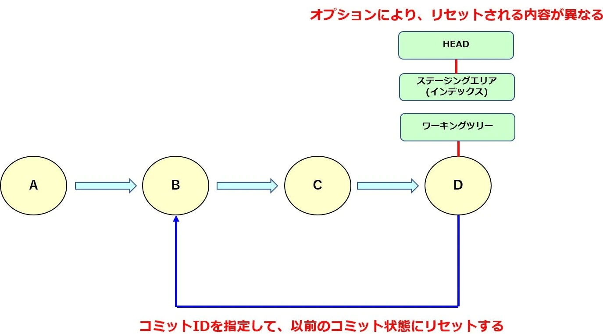
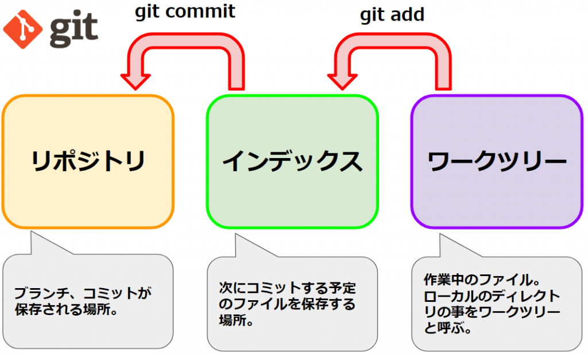
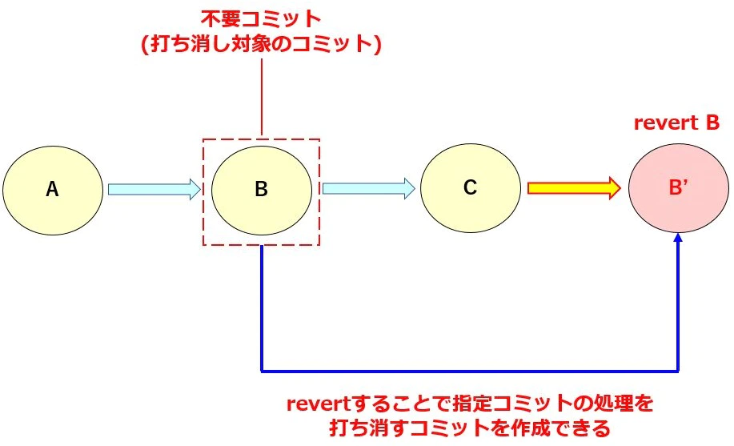

## init
 
 - initの目的は現作業ディレクトリに.gitの隠れディレクトリを作成してgitの管理下に置くこと

 ## HEAD

- 現在の編集点をさす

## Stash

- 自分がよく使うやつ。一時的に退避させるのに役に立つ。

## Reset

https://qiita.com/Sammy_U/items/e37c7242544fd1da81be

- HEADを指定した状態に戻すことができる。
- 痕跡が残らない

オプションによる違い
- --hard　HEAD、インデックス、ワーキングツリー全てをリセットする
- --mixed　HEAD、インデックスをリセットする
- --soft　HEADのみリセットする。

### インデックスやワークツリーとは

- インデックスは別名ステージングともいう。別名の通りaddの内容を記憶しているのがこいつ。
- 実際に変更作業をおこなっているローカルのディレクトリ（ファイル）をワークツリーと呼ぶ

## Revert

- 痕跡が残る
- 指定したコミットを打ち消すコミットを新たに行うことができる。
- 

### resetとrevertのメリットデメリット
- reset
    - メリット
・誤ったコミット自体を削除出来るのでコミットログが見やすい
・HEADの位置を大幅に移動することができる

    - デメリット
・チームで開発にて他の人が同じブランチで作業していた場合に、コンフリクトがおきたり、エラー発生の原因となる可能性がある
・コミット自体を削除してしまうため、復元作業に少し手間がかかる

- revert
     - メリット
・コミット自体を削除するわけではないので、安全にコミットを元に戻すことができる
・誤った履歴が残ることでrevert事態の取り消しも容易に行うことができる

    - デメリット
・誤った履歴が残ってしまうので、コミットログが見づらくなる

実際に動かしてみると
- softだとステージングされた状態まで戻る
- mixedだとステージング前まで戻される
- hardだとコードそのものが削除される。

### fetch

pull=fetch+mergeである。

remoteリポジトリの変更を取り込み一時的にFETCHHEADを作成する。