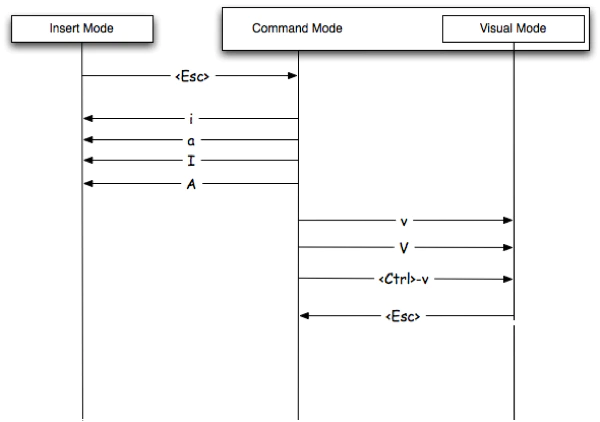

# vimの書き方まとめ

## モードの切り替え
1. Normalモード
    
    - esc,ctrl+cをつかうと、Normalモードに移行することができる！
1. Insertモード
    
    - iをつかうと、カーソルの前からInsertモードに移行することができる。
    - Iをつかうと、行の先頭に移動してInsertモードに移行することができる。
    - aをつかうと、カーソルの後からInsertモードに移行することができる。
    - Aをつかうと、行の末尾に移動してInsertモードに移行することができる。
    - oをつかうと、後ろに改行を作ってInsertモードに移行することができる。
    - Oをつかうと、前に改行を作ってInsertモードに移行することができる。
    - sをつかうと、カーソル下の文字を削除してInsertモードに移行することができる。
    - S, ccをつかうと、カーソル下の行を削除してInsertモードに移行することができる。
    - Cをつかうと、カーソルから行末までを削除してInsertモードに移行することができる。

1. Visualモード

    - vをつかうと、文字単位のVisualモードに移行することができる。
    - Vをつかうと、行単位のVisualモードに移行することができる。
    - ctrl+vをつかうと、矩形単位のVisualモードに移行することができる。

## 移動の仕方
1. H,J,K,L

    - H,J,K,Lをつかうと、それぞれ左下上右に移動することができる。

1. ヤンク(コピー)

    - yy、Yをつかうと、行をコピーすることができる。

1. 貼り付け

    - pをつかうと、行下に貼り付けることができる。
    - Pをつかうと、行上に貼り付けることができる。

1. 削除

    - ddをつかうと、行を削除することができる。
    - Dをつかうと、カーソル下から行末まで削除することができる。

1. w,W

    - wをつかうと、次の単語の先頭に移動することができる。
    - Wをつかうと、空白と改行で区切られた次の単語の先頭に移動することができる。

1. e,E

    - eをつかうと、次の単語の末尾に移動することができる。   
    - Eをつかうと、空白と改行で区切られた次の単語の末尾に移動する

1. b,B

    - bをつかうと、前の単語の先頭に移動することができます。
    - Bをつかうと、空白と改行で区切られた前の単語の先頭に移動することができます。

 1. gg, G

    - ggをつかうと、ページの先頭に移動することができます。
    - Gをつかうと、ページの最後に移動することができます。
    - 行番号+Gをつかうと、その行に移動することができます。

1. 一行一文字検索

     - f+?をつかうと、カーソルの右方向に対して一文字検索を行う。
     - F+?をつかうと、カーソルの左方向に対して一文字検索を行う。
     - t+?をつかうと、カーソルの右方向に対して一文字検索を行う。(文字の手前に移動する)
     - T+?をつかうと、カーソルの左方向に対して一文字検索を行う。(文字の手前に移動する)
     - ;をつかうと、カーソルの右方向に対して繰り返し検索を行う。
     - ,をつかうと、カーソルの左方向に対して繰り返し検索を行う。

1. ページ内文字検索

    - /+?をつかうと、ページ先頭から文字列検索を行う。
    - ?+?をつかうと、ページ最後から文字列検索を行う。
    - nをつかうと、順方向に対して繰り返し検索を行う。
    - Nをつかうと、逆方向に対して繰り返し検索を行う。

1. カッコ移動

    - ％をつかうと、対とるカッコに移動する。

## vimは言語！！！

https://qiita.com/baby-degu/items/9b6b275b72c37a02001c

## vimでのページ遷移

- 0で行の先頭へ移動できる。
- ^でも行の先頭へ移動できる。
- ＄で行の末尾へ移動できる。
- ＋で下の行の先頭へ移動できる。
- -で上の行の先頭へ移動できる。

- ctrl+uで半画面分上へ移動する。
- ctrl+dで半画面分下へ移動する。
- ctrl+bで一画面分上へ移動する。
- ctrl+fで一画面分下へ移動する。
- {で段落ごとに上へ移動する。
- }で段落ごとに下へ移動する。

# Insert中にコマンドを走らせる方法

- ctrl+o+?でコマンドを一つ走らせることができる。