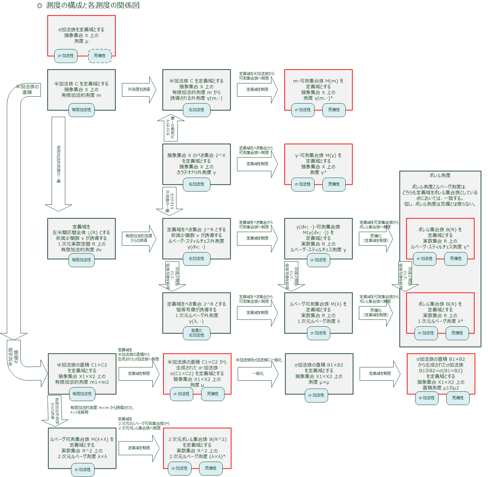
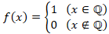
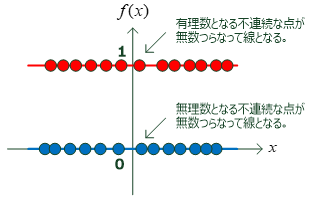
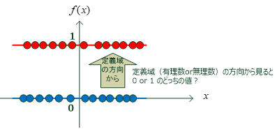
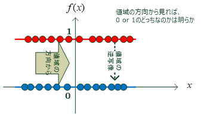
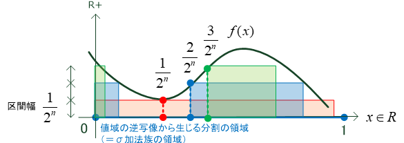
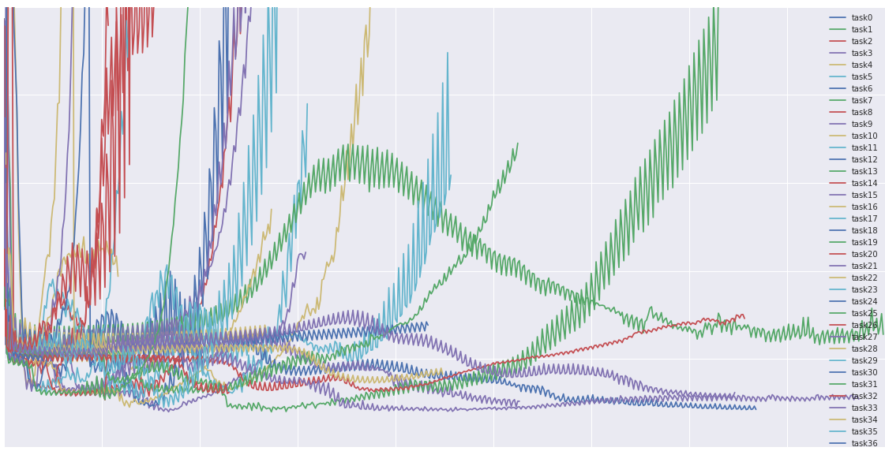
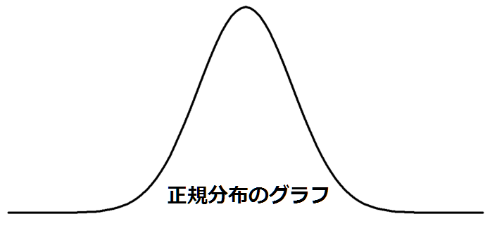
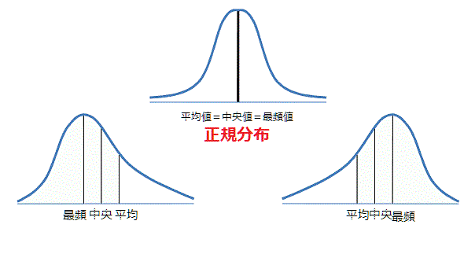

『ルベーグ積分と関数空間』

## ヒルベルト空間へのロードマップ

① 線形空間
実空間のベクトルの性質を一般化した空間
集合要素に対してベクトル演算を行えることを証明する。

線形空間の元の特性を考えなければならない。
ベクトルの要素が実数なのか？複素数なのか？
演算を行う上で考慮しなければならない。
また、ベクトル空間の 7 公理を満たすのであればどんなものであれ元にできることを利用する。

② 数線形空間
実数および複素数を元とするであろう線形空間の一部を数ベクトル空間と呼ぶ。

③ 線形関数空間
上述のベクトル空間の 7 公理を満たす場合の特殊例として、関数の集合を使える場合がある。
関数を元とする線形空間になるため、これを線形関数空間と呼ぶ。

ここまでは空間＝ただの集合という意味合いが強い。
とりあえず、７公理の計算ができるならばそれを線形空間と認めようと言っているだけである。
ただ点を集めて作っただけと言える。

世界は点が存在するだけではない。
星座のように独立しているように見える個々の星々も関係性を見出される。
現実においても、あらゆるものは影響を与え合っていて独立しているものなどない。

個々の星の相互関係を表すために最も重要なのは距離だろう。
線形空間にも同じように距離が導入される。

これをノルム空間と呼ぶ。
ノルムとは？
現実世界にもいても距離の測り方は様々ある。道のりで測ったり、直線距離で測ったりする。
前者を数学的には L1 ノルム（マンハッタン距離、街道距離)とよぶし、後者を L2 ノルム(ユークリッド距離と呼ぶ)
大概は、人間は現実の距離感をユークリッド距離で判断する。
こう言った距離のが様々な考え方をまとめたものをノルムと呼んで一般化するという。

先ほど線形空間は二つに分けられた。

・数線形空間
・線形関数空間

である。それぞれにおいて派生したノルム空間を定義できる。

それを特に
・線形関数空間 -> バナッハ空間と呼ぶ。

ここでバナッハ空間は別名として(バナッハ空間の方が別名であるが)完備ノルム空間と呼ばれる。

完備とは=>空間内の基本列が収束すること。
要するには、有界で収束するということを暗に縛ってくれていると言える。
<<<<<<< HEAD
つまりはバナッハ空間を使いたい時というのは、
・関数の類似度をしりたい。（ノルム)
・収束を使う＝極限を使いたい。
ことを陰ながら示していると言えるのではなかろうか。

http://www.misojiro.t.u-tokyo.ac.jp/~murota/lect-kisosuri/complete051120.pdf

・完備なら，近似の努力が報われる．
・完備なら，極限の存在が有限のところで判定できる．

＠関数空間
https://www.youtube.com/watch?v=NvEZol2Q8rs

ようやく関数空間を理解したでええええ。

ベクトルと関数は似ている？？

ベクトルと関数がよく似ているとはどういうことだろうか？
この議論により結局のところ線形空間の元はベクトルだけでなく関数が使えるのではないかというアイデアにたどり着き、バナッハ空間やみんな大好きヒルベルト空間へと行き着くこととなる。

ベクトルとはなんなのだろう？というところから話は始まる。
そんなん、数字が縦に何個も並んでひとまとまりとして扱えるようにしたもんだろってことを言われると思う。実際、ベクトルとは実際に表に現れているのはスカラーが縦列に並んでいる状態であり、このスカラーは基底ベクトルを如何様に倍するかを表しているのである。

さて、じゃあベクトルに関数が似ているというならば教えてくれや？と言われるだろう。

ベクトルでは基底ベクトルは直交ベクトルになっているイメージが強い。
別にそうでなくてもいいのだが、実世界の３次元を表す時、XYZ の直交している基底ベクトルで表されることが多いのでメジャーな認識であると思う。関数に置ける直交ベクトルは直交ではなく平行であると考えればよろしい。XYZ の直交ベクトル空間上において XY 平面を考えた時、X を引数ととる関数 F(x)が存在した場合 Y 軸方向に平行なベクトルが X 軸の各点から関数 F(x)上の点まで伸びていると考えると良い。

よって F(x)が連続関数で閉区間[a,b]で定義される時、a から b の間の全ての点からベクトルがビヨーンと伸びている。
例えば[1,10]の中から整数のみを引数として受け付けるとすると[1,2,3,4,....10]と 10 次元ベクトルになることがわかる。

関数空間に関して正直なところ次元は無限に近づいてしまう。いくらでも分割できるからである。
しかし、何次元になろうとも F(x)をまるで基底ベクトルにするようなベクトルのような x が定義でき、ベクトル空間の 7 公理をクリアしているのであればそれは線形空間の一部として認められるはずである。これを線形関数空間と呼ぶ。

線形関数空間であるならば、距離空間公理を満たせば距離空間になりノルム空間になりうる。
関数 A を Fa(x)として引数 x を N 次元ベクトルを定義すれば、似たような関数 B があれば A と B の距離を算出できるはずである。

x が１の時の差の二乗。。。。。。。。x が１０００の時の差の二乗。。。。シグマで囲って 1/2 乗すればユークリッドノルムが算出でき、ノルム空間として定義できるはずである。

こうしてノルム空間として定義して、かつ基本列が収束する時、これを新たな空間バナッハ空間(完備ノルム空間)と呼ぶ。
特に、基本列が収束する時を完備であるという。

完備は何が嬉しいのか？

http://web.econ.keio.ac.jp/staff/hattori/lp.pdf

#### バナッハ空間とルベーグ空間(Lp 空間)

https://www.ms.u-tokyo.ac.jp/~aida/lecture/19/Lebesgue-text2.pdf
https://www.ms.u-tokyo.ac.jp/~aida/lecture/log.html

バナッハ空間の一種（＝完備ノルム空間)である Lp 空間

？測度ってなんじゃろな？
・ルベーグ測度

http://yagami12.hatenablog.com/entry/2018/11/04/232957

a kernel function is a similarity function

most similar is 1
least similar is -1 => outputs

ちな　 dot products = inner products
ドット積と内積はおんなじ意味(wikipedia を見るに内積空間に置いて初めてドット積は内積と呼ばれるようになると考えられる。)

・ダルブーの上積分と下積分(リーマン積分)
謎の sup と inf を解明する。

http://www2.math.kyushu-u.ac.jp/~hara/lectures/05/biseki4b-051109.pdf

• 定積分は定義できなくても，「上積分」「下積分」はいつでも定義できること（Darboux の定理，以下の定理
4.2.1）
• 定積分が定義できる必要十分条件は上積分と下積分の値が等しいこと（定理 4.2.2）
• 定積分が定義できる十分条件の一つは f が連続関数であること（定理 4.2.3）

上積分はそれぞれの長方形区間内に置いて最大値を取るものをさす
下積分はそれに対して最小値を取るものをさす。

有界な単調減少列は極限を持つ。。。。

定積分の証明(リーマン)でこの表現が出るということは。。。
これはつまりはコーシー列(単調減少列)が収束することを表しているので完備性が成り立っていることをさしている。

http://yagami12.hatenablog.com/entry/2018/11/04/232957
こっちに戻るぜよ
・ディリクレ関数
以下のように有理数であれば１を、無理数であれば０を返すディリクレ関数と呼ばれるこの関数はリーマン積分できないため、しばしばルベーグ積分導入の例として使われる。

リーマン積分は縦方向短冊と例えられる。

対してルベーグ積分は横方向短冊と例えられる。

まあ、厳密には横方向短冊というよりかは x じゃない軸を基準にして積分を行なう。ディリクレ関数の場合は y 軸。

上図のように
リーマン積分が x 軸を等分割していたのに対して、ルベーグ積分は y 軸を等分割している。
この場合は y 軸の分割区間に置ける高い方を採用している。

μ はルベーグ測度をさす

http://watanabeckeiich.hatenablog.com/entry/2016/10/08/214834

http://yagami12.hatenablog.com/entry/2018/11/04/232957

ラグランジュ未定乗数法と KKT 条件(カルーシュ・クーン・タッカー条件)

https://oshiete.goo.ne.jp/qa/2672171.html

関数 f()の最小化問題を束縛条件 g(),p(),q()の下で考えるとき
ラグランジュ未定乗数をそれぞれの束縛条件に対して a,b,c と考えると

１。f の引数である x1 と x2 に対する偏微分は 0 になる。
２。ラグランジュ未定乗数 a による偏微分も 0
3。b*p()と c*q()がそれぞれ 0 になる → これを KKT 条件と呼ぶ。
p(x1,x2)≦0, q(x1,x2)≦0 　…(4)
b ≧0, c≧0 　…(5)

たとえば b p(x1,x2) = 0 　ってのは、b か p(x1,x2)の少なくとも一方が 0 であることを要求している。これは、「解が p(x1,x2)=0 の曲線上にない場合には、b=0 でなくちゃいけない」ってことです。

f(x1,x2)のグラフを等高線で描き、様々な(x1,x2)における f(x1,x2)の最大傾斜方向を描き込んで、さらに g(x1,x2)=0, p(x1,x2)=0, q(x1,x2)=0 の曲線も重ねて描いてみると、(1)～(5)の意味が見えて来るでしょう。

https://to-kei.net/distribution/normal-distribution/nature/

## 勾配法

機械学習は多量のパラメータをもつ最適化問題をとく手法と言える。

勾配法は最適化問題を解決するための手法の一つと言える。
もちろんこれまで使ったラグランジュの未定乗数法やそれに付随して現れた KKT 条件も最適化問題の解決手法の一つと言える。

確率的勾配降下法や momentumSGD や Adam など色々ある。
https://www.amazon.co.jp/Python%E3%81%A7%E3%81%AF%E3%81%98%E3%82%81%E3%82%8B%E6%A9%9F%E6%A2%B0%E5%AD%A6%E7%BF%92-%E2%80%95scikit-learn%E3%81%A7%E5%AD%A6%E3%81%B6%E7%89%B9%E5%BE%B4%E9%87%8F%E3%82%A8%E3%83%B3%E3%82%B8%E3%83%8B%E3%82%A2%E3%83%AA%E3%83%B3%E3%82%B0%E3%81%A8%E6%A9%9F%E6%A2%B0%E5%AD%A6%E7%BF%92%E3%81%AE%E5%9F%BA%E7%A4%8E-Andreas-C-Muller/dp/4873117984/ref=asc_df_4873117984/?tag=jpgo-22&linkCode=df0&hvadid=295686767484&hvpos=1o1&hvnetw=g&hvrand=4496894850164101105&hvpone=&hvptwo=&hvqmt=&hvdev=c&hvdvcmdl=&hvlocint=&hvlocphy=1009343&hvtargid=pla-526272655673&psc=1&th=1&psc=1

これに乗ってるやつ。
簡単にいうと坂道の転がり方を様々なパラメータを付け加えたりして抑制したりして結果を安定しようとする手法が色々ある。

http://yagami12.hatenablog.com/entry/2017/09/17/101739

https://code-graffiti.com/special-method-in-python/

## 正規分布

正規分布とは統計・統計学を理解する上で一番大切な確率分布です。その名前（正規分布 normal distribution）からもわかる通り、"normal"な、「ありふれた」「通常の」確率分布です。名前の所以は、自然界や人間の行動・性質など様々な現象に対して、よく当てはまるところから来ています。そして、そのグラフは、下図のように左右対称な曲線になります。

・平均値と最頻値と中央値が一致する。
・平均値を中心にして左右対称である。（直線 x=μ に関して対称）
・x 軸が漸近線である。
・分散（標準偏差）が大きくなると、曲線の山は低くなり、左右に広がって平らになる。分散（標準偏差）が小さくなると、山は高くなり、よりとんがった形になる。

## ラプラシアンとナブラ

ラプラシアンとはなんなのか？ナブラとはなんなのか？
これらはこれらは関数の最適化問題において勾配法を用いる際に出現する。
ナブラはこの勾配法に置いての勾配を表す逆三角形の記号のことを指す。$\rightarrow$
